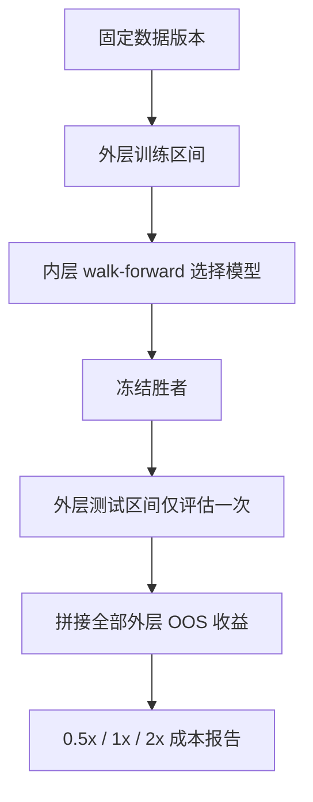

# A 股 / 美股真实历史数据回测指南（M1）

本文描述 FinAgent 1.1.0 的第一阶段真实市场数据回测闭环。“真实”指供应商提供的历史 OHLCV 数据，不代表真实资金交易，也不等同于交易所级撮合复现。

## 1. 能力边界

M1 支持：

- A 股固定 ETF 集合，经 Tushare `fund_daily` 获取日线；
- 美股固定 ETF 集合，经 Alpaca Historical Stock Bars 获取日线；
- 原始执行价、供应商响应留档、规范化 CSV、SHA-256 与不可变 `data_version`；
- 数据完整性质量门；
- 内层模型选择、外层样本外评估的 nested purged walk-forward；
- 收盘后形成信号、下一个共同交易日开盘成交；
- 成交量参与率、佣金、滑点、冲击成本及 0.5x/1x/2x 成本敏感性。

M1 不支持：

- A 股个股动态成分股、退市收益、停复牌、涨跌停、整手、T+1 可卖数量；
- 分红、拆并股和复权价/原始价的双价格账本；
- 美股退市库、完整 corporate action/security master；
- 多币种组合、盘中 bar、订单簿或真实券商成交；
- 将当前结果表述为 live-capital ready。

因此本阶段推荐 ETF smoke study。个股宽截面研究必须等待 Level 2 市场语义完成。

## 2. 数据库选择

| 市场 | M1 默认库 | 接口 | 选择理由 | 注意事项 |
|---|---|---|---|---|
| A 股 | `tushare` | `fund_daily` | 官方接口明确返回 ETF 收盘后日线，历史长度充足 | 需要 Token，接口有积分门槛；`vol` 按“手”转换为股数 |
| 美股 | `alpaca-py` | `StockHistoricalDataClient.get_stock_bars` | Alpaca 官方 Python SDK，request/response 契约明确 | IEX/SIP 权限和历史深度取决于账户套餐 |

安装约束以当前验证版本为下界：`tushare>=1.4.29,<2`、`alpaca-py>=0.44,<1`。供应商文档：

- Tushare ETF 日线：https://tushare.pro/document/2?doc_id=127
- Alpaca Historical Bars：https://docs.alpaca.markets/us/reference/stockbars
- Alpaca Python SDK：https://alpaca.markets/sdks/python/

AkShare、yfinance 等适合探索或交叉核验，但 M1 不把非稳定页面抓取或未经固定的数据修订策略作为可审计主数据源。扩充供应商时应实现相同的 `MarketDataPullRequest -> NormalizedBarRecord -> manifest` 契约，不能把供应商对象直接传给回测器。

## 3. 环境准备

```bash
git pull
./scripts/finagent.sh --check
```

A 股：

```bash
./scripts/finagent.sh python -m pip install -e '.[dev,a-share]'
export TUSHARE_TOKEN='你的 token'
```

美股：

```bash
./scripts/finagent.sh python -m pip install -e '.[dev,us-market]'
export ALPACA_API_KEY='你的 key'
export ALPACA_SECRET_KEY='你的 secret'
```

不要把 Token、Key 或 `.env` 提交到 Git。`finagent.sh` 会清理 ROS 2 的 Python/CMake/动态库变量，但保留上述业务凭据供单次子进程使用。

## 4. 配置

仓库提供：

- `configs/markets/a_share_etf_smoke.toml`
- `configs/markets/us_etf_smoke.toml`

`[market]` 控制供应商、区间、固定资产集合和输出目录；`[study]` 控制 walk-forward、执行成本、组合约束与报告目录。

| 层级 | 训练 | 测试 | 步长 | 作用 |
|---|---:|---:|---:|---|
| 外层 | 756 日 | 126 日 | 126 日 | 一次性样本外性能估计 |
| 内层 | 504 日 | 63 日 | 63 日 | 只在外层训练区间内选择候选模型 |

`purge_bars=1` 对应 1 日 forward label，`embargo_bars=5` 提供额外时间隔离。候选集在运行前冻结，失败候选不能事后删除。

若修改资产集合，必须满足 `max_weight * 资产数 >= 1 - cash_weight`，否则组合约束不可行。账户权限不足时可缩短区间或更换有权限的 feed，但不能为通过质量门而事后删除缺失日期。

## 5. 拉取和固化数据

```bash
# A 股
./scripts/finagent.sh python scripts/pull_market_data.py \
  configs/markets/a_share_etf_smoke.toml

# 美股
./scripts/finagent.sh python scripts/pull_market_data.py \
  configs/markets/us_etf_smoke.toml
```

每个输出目录包含：

| 文件 | 作用 |
|---|---|
| `raw_records.json` | 供应商原始响应的可复现留档 |
| `bars.csv` | FinAgent 规范化 OHLCV；时间均含时区 |
| `quality_report.json` | 数据质量门及错误代码 |
| `manifest.json` | 请求指纹、文件 SHA-256、拉取时间、数据版本 |

`data_version` 由供应商、规范化请求和 `bars.csv` digest 决定；仅拉取时间变化不会改变版本，供应商修订数据内容后会生成新版本。

M1 只接收 `adjustment="raw"`。将复权收盘价同时当作可成交价格会破坏执行真实性，因此在没有双价格 corporate-action bundle 前直接 fail closed。

## 6. 数据质量验证

拉取脚本会自动执行质量门，也可独立复验：

```bash
./scripts/finagent.sh python scripts/validate_market_data.py \
  data/market/a_share_etf_smoke/bars.csv \
  --expected-symbol 510300.SH \
  --expected-symbol 510500.SH \
  --expected-symbol 159915.SZ \
  --expected-symbol 159919.SZ
```

| 代码 | 含义 | 处理 |
|---|---|---|
| `DQ-01` | 同一资产、同一事件时间重复 | 检查分页/合并逻辑，禁止简单去重掩盖来源 |
| `DQ-02` | `available_at` 非严格递增 | 检查时区和供应商时间语义 |
| `DQ-06` | 请求资产未返回 | 检查代码、权限与上市日期 |
| `DQ-10` | 固定集合资产交易日不一致 | M1 fail closed；不能误当成动态可交易集合 |

`--allow-calendar-gaps` 仅用于诊断，不等于实现停牌/退市语义，也不应作为 M1 正式报告的通过条件。

## 7. 运行回测

```bash
./scripts/finagent.sh python scripts/run_market_backtest.py \
  configs/markets/a_share_etf_smoke.toml

./scripts/finagent.sh python scripts/run_market_backtest.py \
  configs/markets/us_etf_smoke.toml
```

运行前脚本会重新计算 `bars.csv` SHA-256；若与 manifest 不一致则拒绝执行。



每个候选均使用 PIT feature window。日线在本地收盘后才可见，信号只能在下一共同交易日开盘执行。组合保持显式现金缓冲；如果 next-open 跳空和成本仍造成负现金，M1 直接失败并要求提高 `cash_weight`，不会静默借款。

## 8. 报告读取

报告 JSON 顶层为 `finagent.market-study.m1.v1`，每个成本场景包含：

- `study_id`、`data_version`、固定 universe 和完整配置；
- 每个 outer fold 的内层平均 Sharpe、选择结果和外层指标；
- 拼接外层 OOS 后的总收益、年化收益、波动、Sharpe、最大回撤；
- gross traded weight 与绝对交易成本。

验收时确认：

1. 三个成本场景均完成，`data_version` 一致；
2. 外层 fold 数量和日期符合预期；
3. 2x 成本下结果没有结构性崩溃；
4. 结果不是由单一 fold 主导；
5. turnover、成本和参与率具有经济可解释性；
6. A 股结果仅作为 ETF fixed-universe engineering smoke，不作个股策略认证。

不要根据外层测试结果重新修改候选集、窗口或成本后仍沿用同一研究声明。发生此类修改时，应创建新的 `ResearchProgram`/实验预算并保留旧失败证据。

## 9. 完整验收命令

```bash
# 代码与环境
./scripts/run_tests.sh -q
./scripts/run_tests.sh --cov=finagent --cov-report=term
./scripts/finagent.sh ruff check src tests scripts --select E9,F63,F7,F82
./scripts/finagent.sh ruff check \
  src/finagent/data/ingestion src/finagent/backtest/market_study.py \
  src/finagent/backtest/timed.py tests/test_market_data_ingestion_m1.py \
  tests/test_market_study_m1.py tests/test_timed_backtest_phase2.py \
  scripts/pull_market_data.py scripts/validate_market_data.py \
  scripts/run_market_backtest.py

# 数据
./scripts/finagent.sh python scripts/pull_market_data.py CONFIG.toml
./scripts/finagent.sh python scripts/validate_market_data.py PATH/bars.csv

# 回测
./scripts/finagent.sh python scripts/run_market_backtest.py CONFIG.toml
```

通过 M1 的定义是：代码测试通过、数据 manifest 可复验、质量门通过、嵌套 OOS 报告可重复生成。它不是盈利保证，也不是 A 股/美股实盘交易上线许可。

## 10. Level 2 后续工作

进入个股或长期 paper/shadow 前，需要按优先级补齐：

1. security master 与逐日 PIT universe；
2. 退市 terminal return、停复牌和 corporate actions；
3. A 股 T+1、整手、涨跌停、印花税与非对称费用；
4. 复权研究价格和原始执行价格的双账本；
5. delisted US equities 与 survivorship-bias-free universe；
6. 交易所日历（含半日市）和供应商分页/限频恢复；
7. 历史回测通过后，才进入 paper/shadow 长期观察。
